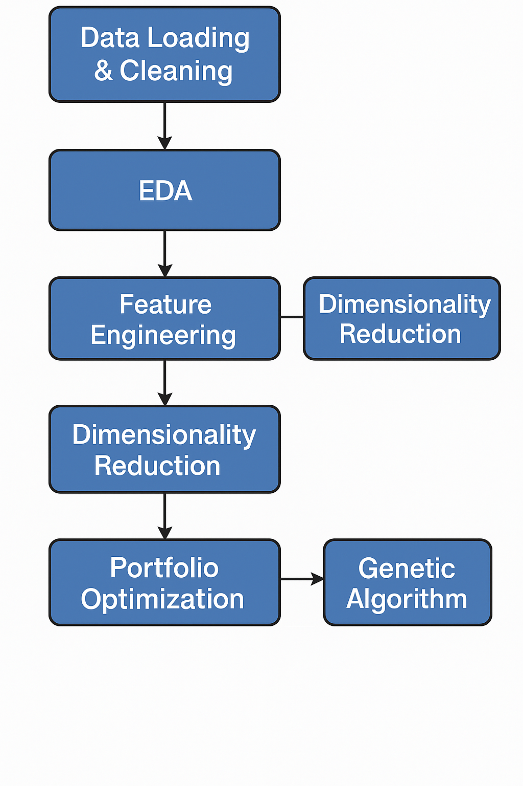
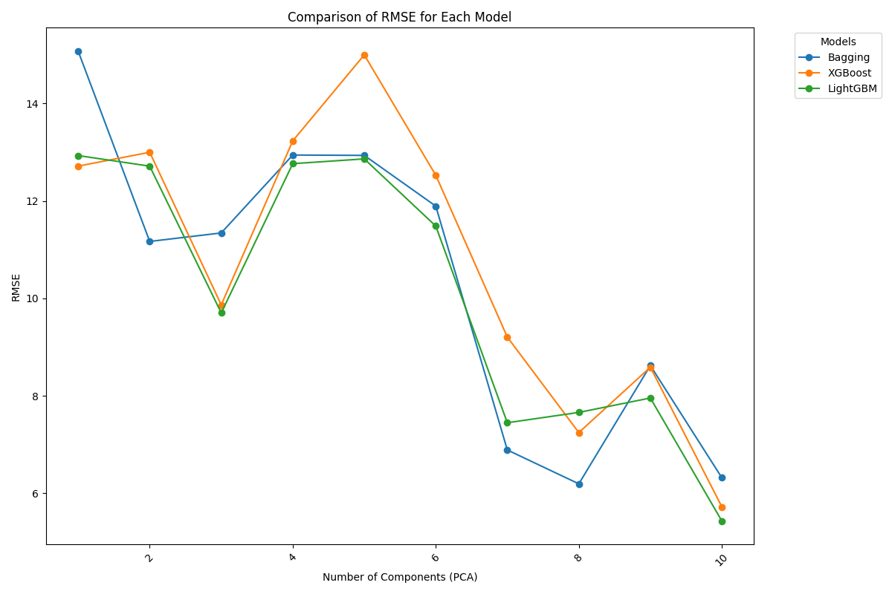
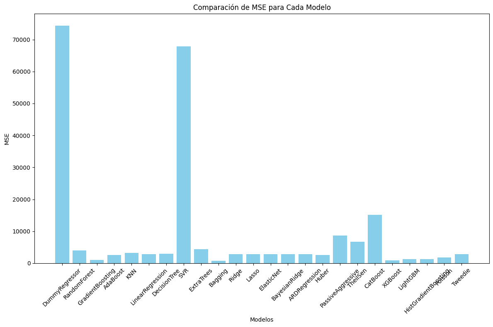

# Stock Portfolio Forecasting and Optimization on S&P 500 🚀



A comprehensive Jupyter Notebook that demonstrates data loading, exploratory analysis, machine learning forecasting, dimensionality reduction, and portfolio optimization on historical S&P 500 stock data (2010–2023).

---

## 📋 Table of Contents

1. [Project Overview](#project-overview)  
2. [Repository Structure](#repository-structure)  
3. [Installation & Setup](#installation--setup)  
4. [Usage](#usage)  
5. [Notebook Sections](#notebook-sections)
6. [Forecasting](#forecasting)
7. [Genetic Algorithm Details](#genetic-algorithm-details)
8. [Images](#images)  
9. [License](#license)  
10. [Contact](#contact)

---

## 🚀 Project Overview

This project uses historical daily closing prices of S&P 500 stocks from 2010 to 2023 to:

- Perform **exploratory data analysis (EDA)** and visualize market trends.  
- Build **supervised machine learning** models (e.g., LSTM, Random Forest) to forecast future prices.  
- Apply **dimensionality reduction** (PCA) for feature engineering and visualization.  
- Construct **optimized portfolios** by maximizing return under risk constraints using mean-variance optimization(Constant Absolute Risk Aversion function).

---

## 📂 Repository Structure

```
├── data/                    
│   ├── raw_stocks/                 
│   └── stocks/           
├── images/                  
│   ├── pipeline-diagram.png 
│   ├── portrait.jpg
|   ├── mse_comparison.png
|   ├── ...
|    
├── notebooks/               
│   └── sp500_portfolio.ipynb
├── requirements.txt         
└── README.md                
```

---

## ⚙️ Installation & Setup

1. **Clone the repository**
   ```bash
   git clone https://https://github.com/alejandromorislara/Stock-Portfolio-Forecasting-and-Optimization-on-S-P-500.git
   cd Stock-Portfolio-Forecasting-and-Optimization-on-S-P-500
   ```

2. **Create a virtual environment**
   ```bash
   python3 -m venv venv
   source venv/bin/activate
   ```

3. **Install dependencies**
   ```bash
   pip install -r requirements.txt
   ```

---

## ▶️ Usage

1. **Download or place raw data** into `data/raw/` (e.g., `sp500_prices.csv`).
2. **Run the notebook**:
   ```bash
   jupyter lab notebooks/sp500_portfolio.ipynb
   ```
3. **Follow each section** to reproduce EDA, modeling, and optimization results.

---

## 📝 Notebook Sections

1. **Data Loading & Cleaning**  
   - Import daily closing prices.  
   - Handle missing values and merge metadata.
2. **Exploratory Data Analysis**  
   - Time series plots, distribution of returns.  
   - **Figure:** Correlation heatmap → `./images/eda-correlation.png`
3. **Feature Engineering**  
   - Compute technical indicators (moving averages, volatility).
   - Dimensionality Reduction : PCA
4. **Model Building & Forecasting**  
   - Train/test split, model comparison, hyperparameter tuning.
5. **Portfolio Optimization**  
   - Mean-variance frontier using CARA function. Portfolio selection according to the investor's risk.  
   - **Figure:** Genetic Algorithm performance → `./images/genetic_algorithm_results.png`

---

## 📈 Forecasting

We leveraged historical stock data from multiple sources (e.g., Yahoo Finance, Alpha Vantage) and experimented with diverse machine learning approaches—including Bagging, XGBoost, LightGBM, Gradient Boosting, and more—to predict future price movements. To mitigate overfitting and noise, we applied Principal Component Analysis (PCA) and retained components based on the Kaiser criterion (eigenvalues > 1), leading to a concise feature set that improved model stability.

**Key Forecasting Results**  
(Top performing models)

| Model               | MSE      | MAE      | RMSE    | MAPE    |
|---------------------|---------:|---------:|--------:|--------:|
| **Bagging**         |   838.18 |   28.95  |  11.85  |  7.07%  |
| **XGBoost**         |   843.28 |   29.04  |  12.43  |  7.53%  |
| **GradientBoosting**| 1,075.11 |   32.79  |  12.94  |  7.79%  |
| **LightGBM**        | 1,233.66 |   35.12  |  12.74  |  7.40%  |
| **HistGradient**    | 1,234.39 |   35.13  |  13.45  |  7.79%  |

  
*RMSE variation across PCA component counts for Bagging, XGBoost, and LightGBM.*

  
*Overall MSE performance across all tested models.*

## 🖼️ Genetic Algorithm Details

This project employs a Genetic Algorithm (GA) to optimize stock portfolios under capital and liquidation constraints. Key GA components are summarized below:

### Chromosome Representation
Each chromosome is a 2D matrix (assets × days) where entries denote units bought (+), sold (–), or held (0). Capital constraints and end‑of‑month liquidation are enforced. Example for 3 assets over 5 days:

```text
[ [10,  0, -5,  0,  0],
  [ 0, 20,  0,  0, -10],
  [ 0,  0,  0, 15,   0] ]
```

### Crossover
Combines two parents by identifying their most traded assets and iteratively swapping trades to produce feasible offspring. If no valid swaps exist, original parents are retained.

**Example:**

Parent 1:
```text
[ [0, 5, 0, -2, 0],
  [2, 0, -3, 0, 1],
  [0, 0, 4, 0, 0] ]
```

Parent 2:
```text
[ [0, 0, 3, -1, 0],
  [5, 0, 0, 4, 0],
  [0, 2, 0, 0, -3] ]
```

Children 1:
```text
[ [0, 3, 0, -2, 0],
  [2, 0, -3, 3, 1],
  [0, 0, 4, 0, 0] ]
```

Children 2:
```text
[ [0, 3, 3, -1, 0],
  [1, 0, 0, 4, 0],
  [0, 2, 0, 0, -3] ]
```

### Mutation
Introduces diversity by selecting valid trade points (must have prior purchase and subsequent sale), reducing that trade, and reinvesting proceeds in a new asset with a random sale day before month end.

**Example Before Mutation:**
```text
[ [0, 10, 0, 5, 0],
  [0, 0, 0, 0, 15],
  [0, 0, 0, 0, 0 ],
  [5, 0, 0, 0, 0 ],
  [0, 0, 0, 10, 0] ]
```

**Example After Mutation:**
```text
[ [0, 5, 0, 5, 0],
  [0, 0, 0, 0, 15],
  [0, 0, 3, 0, 0 ],
  [5, 0, 0, 0, 0 ],
  [0, 0, 0, 10, 0] ]
```

### Elitism
Carries the top-performing chromosomes unchanged into the next generation to preserve high‑quality solutions and prevent loss from stochastic operations.

### Fitness Evaluation: CARA Function
Chromosomes are scored using a Certainty‑Equivalent Risk Aversion (CARA) objective:

CARA = R_p - (γ / 2) · σ_p²

- *R_p*: Expected portfolio return  
- *σ_p²*: Portfolio variance  
- *γ*: Risk-aversion parameter


### Sample Optimization Results
| Pop. Size | Tour. Size | Mut. Prob. | Cross. Prob. | γ   | Generations | Elitism | Total Money | Zero Ops | Buy Ops | Sell Ops | Total Ops |
|----------:|----------:|----------:|------------:|:----|-----------:|:-------|-----------:|--------:|-------:|--------:|----------:|
|       100 |         5 |      0.05 |         0.80 | 0.5 |         50 | Yes     |       12,345 |      50 |    120 |     80 |       250 |
|       200 |        10 |      0.02 |         0.90 | 1.0 |        100 | No      |       15,678 |      30 |    150 |     70 |       300 |
|       150 |         8 |      0.10 |         0.70 | 0.7 |         75 | Yes     |       10,432 |      60 |    110 |     90 |       260 |
|        50 |         4 |      0.15 |         0.60 | 0.3 |         30 | No      |        8,910 |      80 |    100 |     50 |       230 |
|       300 |        12 |      0.01 |         0.95 | 1.5 |        150 | Yes     |       18,234 |      20 |    180 |    100 |       400 |


## 🖼️ Images

Add the following files to the `images/` folder in root:

| Filename                   | Description                                      |
| -------------------------- | ------------------------------------------------ |
| `pipeline-diagram.png`     | Workflow diagram summarizing the project steps.  |
| `eda-correlation.png`      | Heatmap of stock return correlations.            |
| `results-backtest.png`     | Plot of optimized portfolio backtest results.    |

---

## 📜 License

This project is licensed under the MIT License. See [LICENSE](LICENSE) for details.

---

## ✉️ Contact

- **Author:** Alejandro Morís Lara & Alfredo Flórez de la Vega
- **GitHub:** [alejandromorislara](https://github.com/alejandromorislara)  
- **Email:** alejandrgi2g@gmail.com

